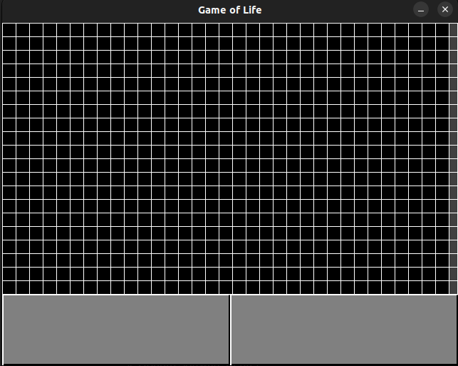

# golui
This is my implementation of Conway's game of life.

Goals:
- A little project outside of work while I wait for some microcontrollers to come in
- Use C
- Use a new library (SDL2)
- Get established with a new coding environment

I've made crude buttons and a grid using SDL2. 

[Here's a video of a glider.](https://github.com/MartinKlimuntowski/golui/blob/main/Gol%20recording.webm)

